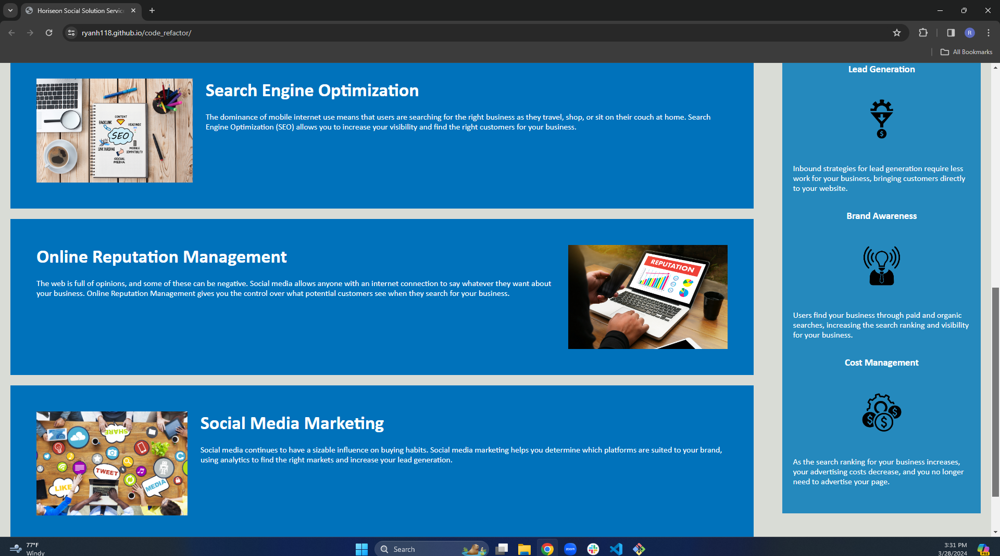

# <code_refactor>

## Description

I was motivated to refactor this code to make it more accesible to naviagte in chrome dev tools.
My goal for this project was to give the reader of the code a better time in being able to break up the code blocks and not getting lost anywhere. It was also my goal to consolidate some of the code into grouped up code blocks. By grouping some of the code into grouped up code blocks I was able to solve the code have redundant code blocks and having people waste more time scrolling when it wasn't needed. I learned throughout this challenge that if you can you should add HTML semantic elements where you can so when you go back to look at it you'll be able to see it faster and easier.

## Website Link

https://ryanh118.github.io/code_refactor/

## Usage

